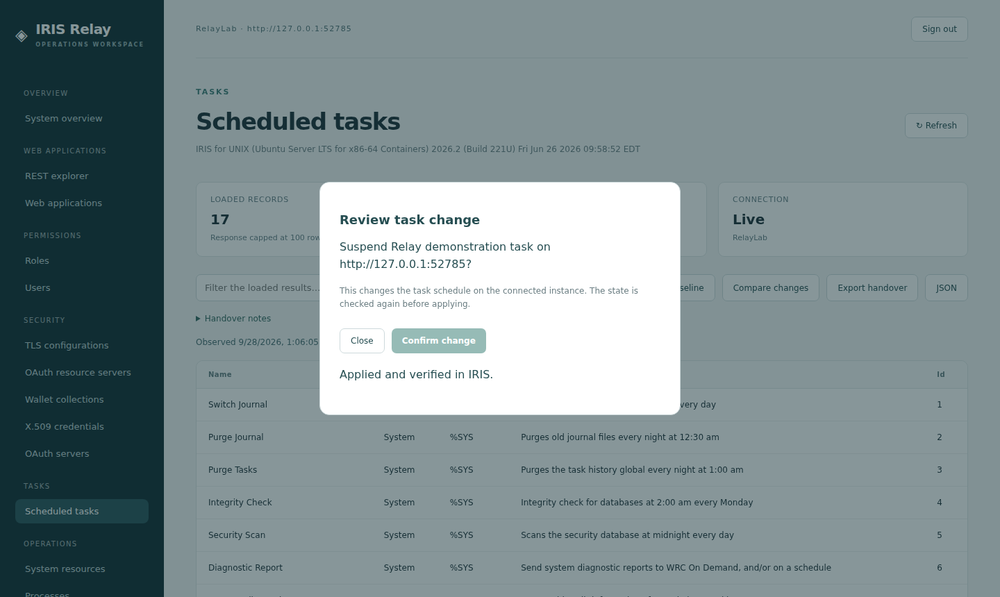
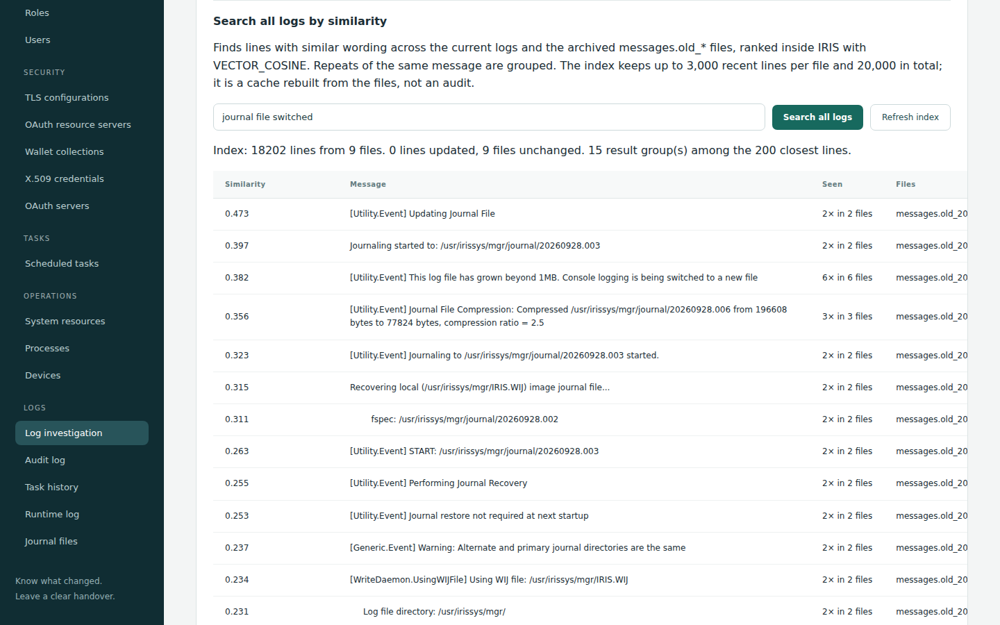
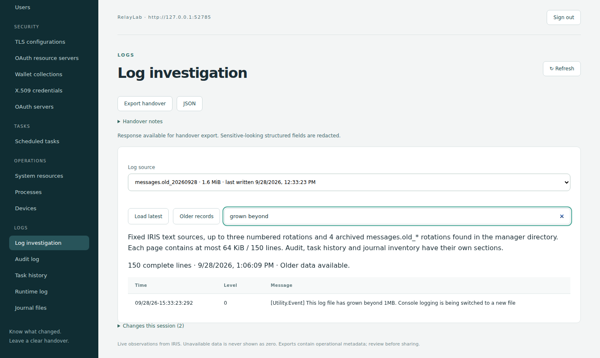
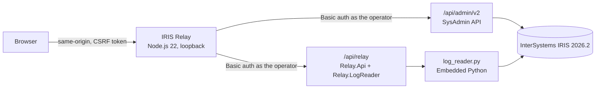

# IRIS Relay

An operations workspace for InterSystems IRIS 2026.2. Investigate an instance, make a management change safely, and leave a clear handover for the next operator.

IRIS Relay is a web UI over the IRIS SysAdmin REST API v2, plus a small IRIS extension (ObjectScript REST class and an Embedded Python log reader). Every change is reviewed first, re-checked right before it is applied, applied once, and then read back from IRIS. A baseline comparison and a Markdown/JSON export show what changed during the shift.



* **Video demo (2:38):** https://youtu.be/i_EW6gS3EJg
* **Open Exchange:** https://openexchange.intersystems.com/package/IRIS-Relay
* **No-install walkthrough (fictional data, no IRIS):** https://rafaorlando3.github.io/iris-relay/
* **Community Opportunity idea implemented:** [DPI-I-966, "Option to show older message.log in IRIS SMP"](https://ideas.intersystems.com/ideas/DPI-I-966)

## Why

IRIS Relay was built for the people who operate IRIS: to investigate problems, make changes safely and leave a clear shift handover. It brings diagnosis, state comparison and the history of changes into one flow, so less time goes into collecting information during an incident.

Our biggest lesson was not to trust the API response alone. On IRIS 2026.2 the task list still reported the old `Suspended` value right after a successful change, while the task detail endpoint reported the new one. Since then Relay checks the state before and after every change, and only reports "verified" when IRIS confirms it.

## Quick start: one command (about 2 minutes)

Requirements: Docker with Compose. Nothing else is installed on your machine.

```sh
git clone https://github.com/rafaorlando3/iris-relay.git
cd iris-relay
docker compose up -d
docker compose exec iris cat /usr/irissys/mgr/relay/lab-credentials.json
```

Open http://127.0.0.1:8787 (use `127.0.0.1`, not `localhost`) and sign in with `username` and `password` from that file. `RelayObserver` with `observerPassword` has only the `%Operator` role, so you can also see how IRIS limits a restricted account.

Compose starts the pinned IRIS Community 2026.2 container, runs `scripts/bootstrap.py` inside it (Relay extension, lab accounts with generated passwords kept inside the container, disposable demo fixtures) and starts Relay once IRIS reports ready. Only port 8787 is published, on 127.0.0.1; IRIS itself is not published. Stop with `docker compose down` (the next `up` creates a fresh lab with new passwords).

## Alternative: lab script and local Node

Requirements: Docker, Node.js 22 or newer and Python 3. No npm packages and no paid service. Use this path for the repeatable live checks and the log rotation helper.

```sh
python3 scripts/lab.py      # disposable IRIS container, credentials in artifacts/lab-credentials.json
npm start                   # IRIS Relay on http://127.0.0.1:8787
```

Both paths run the same `scripts/bootstrap.py` inside the container. Stop with Ctrl+C and `docker stop iris-relay-2026-2`.

Suggested 5-minute tour: Scheduled tasks → Capture baseline → Suspend `Relay demonstration task` → Confirm → Compare changes → Resume it. Then open Log investigation and pick an archived `messages.old_*` file (with the lab script, run `python3 scripts/lab-rotate-log.py` first to create one). Finish with Export handover. The full reviewer script is in [docs/DEMO.md](docs/DEMO.md).

## Install the IRIS side on an existing instance (IPM)

The IRIS part of Relay (the `/api/relay` endpoints, the Embedded Python log reader for current and archived `messages.log` files and the similarity search table) is an IPM package. It creates no users and no demo data.

```
USER> zpm "install iris-relay"
```

Before it appears in the public registry, or to try a local checkout: `zpm "load /path/to/iris-relay"`. It installs `Relay.Api`, `Relay.LogReader` and `Relay.LogLine` in the current namespace, copies `log_reader.py` and `log_vectors.py` to `<manager directory>/relay/`, and creates the `/api/relay` web application with password authentication; every endpoint also checks `%Admin_Operate:U`. Then point the Relay UI at that instance: `IRIS_URL=https://your-test-instance.example npm start` (HTTPS is required for anything but loopback). `zpm "uninstall iris-relay"` removes it.

## What you can do

| Contest area | In IRIS Relay |
| --- | --- |
| Manage web apps and explore REST APIs | Enable or disable custom web applications with review and readback. REST explorer with 28 allowlisted, read-only SysAdmin API operations, HTTP status, timing and export. |
| Permission management | Inspect roles and their holders, edit custom role resource permissions, replace a user's direct roles. Built-in accounts, `%All` holders and escalation roles are protected. |
| Security and secrets | Wallet collection access policies (secret values are never read), X.509 credential owner lists, OAuth resource servers (issuer, audiences, scope, status), TLS configurations (TLS 1.2/1.3 bounds, peer verification cannot be weakened). |
| Task management | Scheduled tasks and task history. Suspend or resume user tasks with state verified through the detail endpoint. System tasks are protected. |
| Operating system | System overview, resources, processes, devices and journal files. |
| Log monitoring and reporting | Embedded Python reader for `messages.log`, System Monitor and alert logs, **including archived `messages.old_*` files (0.3)**, with backward paging and page search. **Similarity search across all of those files with IRIS Vector Search (0.4).** Background audit queries. Markdown/JSON handover exports. |

## How a change works

1. **Review.** You see the target instance and the exact before/after values. A review token expires and can be used once.
2. **Re-check.** Right before applying, Relay reads the configuration again. If someone else changed it, the change is refused.
3. **Apply once.** Only the fields you changed are sent. A replayed confirmation returns HTTP 409.
4. **Read back.** Relay reads the result from IRIS and reports "Applied and verified in IRIS" only when it matches. Otherwise it says the change was accepted but not verified.
5. **Hand over.** The last 100 accepted changes, with their verification result, go into the handover export together with your notes and the baseline comparison.

IRIS remains responsible for authorization: Relay signs in with the operator's own IRIS account and never elevates privileges.

## New in 0.4: search every log file by similarity (IRIS Vector Search)



Type what you are looking for ("journal switch", "license exceeded") and Relay finds lines with similar wording across the current logs, the numbered rotations and the archived `messages.old_*` files. Each line is embedded inside IRIS (Embedded Python) and stored in `Relay.LogLine` with a `VECTOR(DOUBLE, 256)` column; the query is ranked with `VECTOR_COSINE` in IRIS SQL, and repeats of the same message are grouped with how often and in which files they occur. The embedding is lexical (hashed words and character trigrams), so it needs no model download and no data leaves IRIS. The index is a bounded cache (3,000 recent lines per file, 20,000 in total) refreshed incrementally: unchanged files are skipped. Searching needs SQL SELECT on `Relay.LogLine` and refreshing needs INSERT and DELETE; a `%Operator` account gets an explicit "not privileged" answer. Details in [docs/LOGS.md](docs/LOGS.md).

## New in 0.3: archived messages.log files (DPI-I-966)



When `messages.log` grows beyond `MaxConsoleLogSize`, IRIS renames it (for example `messages.old_20260928`, then `messages.old_20260928_1`) and the Management Portal log view shows only the current file (the gap described in idea DPI-I-966). Relay lists the archived files with size and last-write time, newest first, and reads them with the same paging and search as the current log. The browser sends a validated ID, never a path; links and special files are refused. Details in [docs/LOGS.md](docs/LOGS.md).

To try it, run `python3 scripts/lab-rotate-log.py` with the lab running. It produces a real rotation in the lab container and then restores the original setting. It only acts on the container recorded by `scripts/lab.py` in `artifacts/lab-setup.json`. A lab created before 0.3 has no record and is refused: confirm its full ID with `docker inspect -f '{{.Id}}' iris-relay-2026-2` and run `python3 scripts/lab.py --adopt-container <full ID>` once.

## Architecture



* No runtime npm dependencies. The server keeps credentials in memory for the session only and binds to 127.0.0.1 by default.
* Responses are capped (100 rows, 64 KiB log pages) and credential-like fields are redacted before they reach the browser.
* The extension (`src/Relay`) is installed by `scripts/lab.py`; see "Connect to an existing test instance" below to install it elsewhere.

## Technology used

Docker (pinned official IRIS Community 2026.2 image, one-command `docker compose` lab), Embedded Python (log reader and embeddings running inside IRIS), IRIS Vector Search (`VECTOR` column and `VECTOR_COSINE`), an IPM package for the IRIS side (`module.xml`), the SysAdmin REST API v2, and the Community Opportunity idea DPI-I-966. There is no hosted live demo yet; the GitHub Pages walkthrough is a static page with fictional data.

## Validation

```sh
npm test            # 46 JavaScript tests
npm run test:logs   # 26 Python tests (log reader, similarity index, lab helper)
```

With the lab and Relay running, `python3 scripts/verify-management.py` and `python3 scripts/verify-enhancements.py` apply and restore real changes on the lab fixtures, check replay and permission denials, all explorer operations, audit queries and every log source (including archived rotations). Verified on IRIS Community 2026.2 Build 221U on ARM64 (September 19) and x86-64 (September 28). See [docs/VALIDATION.md](docs/VALIDATION.md).

## Limitations

This is an experimental tool for authorized administrators, not a replacement for the whole Management Portal and not a production readiness claim. It does not edit secret values, import or rotate keys, create roles, test a full OAuth provider flow, terminate processes, parse journal contents or read every subsystem log. Session history is not a durable audit. Page search applies to the loaded page; similarity search covers the bounded index described above and ranks by wording, not meaning.

## Detailed guide

### Start an isolated laboratory

Start Docker, then from this directory run:

```sh
python3 scripts/lab.py
npm start
```

Open http://127.0.0.1:8787. The setup script prints the local path to `artifacts/lab-credentials.json`. Use the generated `RelayLab` username and `password` to connect. The `RelayObserver` user uses `observerPassword` and the built-in `%Operator` role for a limited-access demonstration. Do not publish this file.

The script also creates a disposable `Relay demonstration task` scheduled for the following day, so reviewers can test suspension and resumption without touching system tasks. It also creates a disabled `/relay-demo` application and a disabled `RelayDemoUser` account with no roles for application and permission demonstrations. The demo account has a generated password that is not retained and cannot be used to sign in. Its login remains disabled during role tests. A `RelayDemo` wallet collection is created with both edit/use access protected by `%Admin_Wallet:USE`; it contains no real secrets. The script also creates a public, self-signed `RelayDemoCertificate` owned by `RelayLab`, with no imported private key, and a disabled `RelayDemoOAuth` resource server using `https://relay-demo.invalid`. No application is attached and no external identity provider is contacted. The unused generated certificate key is discarded.

The lab binds IRIS to `127.0.0.1:52785`, with a two CPU and 2 GiB memory limit. Relay binds only to `127.0.0.1:8787`. The script refuses to repurpose an existing container without its expected image and local setup record. It does not remove containers or data.

Stop the application with Ctrl+C and stop the laboratory with:

```sh
docker stop iris-relay-2026-2
```

### Connect to an existing test instance

```sh
IRIS_URL=https://your-test-instance.example PORT=8787 npm start
```

The URL is an operator-configured origin, not an arbitrary browser-provided proxy destination. HTTP is accepted only for loopback targets; remote targets require HTTPS with valid certificates. Existing instances need Basic authentication on `/api/admin`. Enter an account with only the privileges needed for your work. Relay does not elevate privileges.

The optional runtime log extension consists of `src/Relay/Api.cls`, `src/Relay/LogReader.cls` and `src/Relay/log_reader.py`. Copy the Python file to `<IRIS manager directory>/relay/log_reader.py` and load both classes into `%SYS`. The local setup installs it in `%SYS` as `/api/relay`, with password authentication and a `%Admin_Operate:U` check. Without the extension the runtime log view reports unavailable; the standard management views still work.

### Review a task change

Choose Scheduled tasks, capture a baseline, and choose Suspend or Resume on a **user-defined** task. Review the task and connected instance, then confirm. Relay checks the state again and verifies the result through `/v2/task/info`. No system task can be changed through Relay. No process termination, data deletion or credential rotation is offered in this build.

The 2026.2 laboratory returned an outdated `Suspended` value from `/v2/tasks` immediately after a successful change. Relay reads user-task state from the detail endpoint before display, preview and confirmation. An accepted HTTP response alone is not treated as verified completion.

### Review applications and permissions

In Web applications, select Manage on `/relay-demo`, change the status and select Review change. Confirm only after checking the target instance and before/after values. Only `Enabled` is sent to IRIS. Restore the disabled status after the demonstration. System applications, applications in `%SYS` and Relay's own connection are protected.

In Users, open `RelayDemoUser`. Choose an existing role such as `%Operator`, review and confirm the assignment, then remove the role again. The account stays disabled throughout. Only `Roles` is sent; profile, password and escalation assignments are preserved. In Roles, select Manage to inspect resources, inherited roles and escalation settings. Custom non-escalation roles also support reviewed description and resource-permission edits, with an impact inventory of up to 100 holders.

The current signed-in account, recognized built-in accounts and direct `%All` holders are protected. Direct `%All` and `%Manager` grants and escalation-only grants are not supported. Other roles may still confer powerful or inherited access: this is a tool for authorized administrators, not a role sandbox. IRIS enforces `%Admin_Secure`. Changes to the target configuration or the selected role definitions invalidate the preview. These checks are optimistic, not an atomic IRIS transaction.

### Explore the API and wallet access

REST explorer provides 28 documented, allowlisted GET operations with validated parameters. It shows HTTP status, elapsed request time, observed timestamp and the IRIS response. List requests are capped at 100 rows. Export the result as Markdown or JSON for handover. It cannot send arbitrary URLs, headers or write methods. Responses are direct API observations; for example, the task-list endpoint may still have the version-specific state lag described above.

For the laboratory demonstration choose Wallet collection policy, enter `RelayDemo`, and run the request. Then open Wallet collections and Manage. Change UseResource to `%Admin_Operate:USE`, review and confirm, and restore `%Admin_Wallet:USE` after the demonstration. The collection is empty: no real secret changes hands. Both resource names are checked against IRIS and any public permission on either resource blocks the change. The administrator needs the IRIS permissions to inspect security resources as well as manage the wallet. Secret values are not read, stored or edited by Relay.

### Review certificate access and OAuth availability

Open X.509 credentials and Manage on `RelayDemoCertificate`. Add `RelayObserver` to the selected owners, review and confirm, then restore only `RelayLab`. Empty owner lists are refused because IRIS treats an empty list as access for all users. Anonymous accounts cannot be added. Relay changes only `OwnerList`; it does not import or rotate a certificate or its key.

In OAuth resource servers, Manage `RelayDemoOAuth`, enable the stored configuration, then restore Disabled. The form also supports description, existing issuer, audiences and required scope; leave those fields unchanged for this availability demonstration. This isolated example demonstrates configuration management, not successful token validation or a working connection to a provider.

### Read audit summaries

Open Audit log, optionally filter by user and server-local begin/end time, and choose a maximum of 100 records. IRIS creates a background query. Relay briefly polls, then offers Check query status if it is still unfinished. Pending results are never presented as an empty completed log. Completed rows show event, timestamp, user, description and namespace, and can be exported. Detailed event payloads, session identifiers and network fields are excluded. Free-text summaries still require review before sharing.

### Handover workflow

Capture baseline, refresh or make a reviewed change, then select Compare changes. Add context under Handover notes. Export handover produces a readable Markdown file; JSON preserves the structured response. Snapshots and notes stay in the browser tab and are cleared on sign-out. The session activity includes the last 100 accepted changes and their readback status. They are not persisted across a browser reload.

Results are capped at 100 records for list views. Each text-log page is capped at 64 KiB and 150 complete lines. Filters apply only to the loaded data. These are operational observations, not an exhaustive audit. Free text may contain sensitive information even though credential-like object fields are redacted. Review exports before sharing them.

### Repeat the local management integration check

With the isolated lab and Relay running on the default ports, run `python3 scripts/verify-management.py`. It temporarily changes the named demonstration application, account roles, wallet policy, certificate owners and OAuth availability, restores them, checks replay and permission denial, and exercises all 28 explorer operations plus an asynchronous audit query. It verifies that Relay targets the laboratory URL before making changes. Generated results stay under ignored `artifacts/`.

### Check the expanded configuration and log workflows

With the isolated laboratory and Relay running, execute `python3 scripts/verify-enhancements.py`. This exercises and restores `RelayDemoTLS`, the unassigned `RelayDemoRole` and `RelayDemoOAuth`, checks replay and observer denials, and checks available versus absent log sources.

## Sources

[Contest announcement](https://community.intersystems.com/post/intersystems-programming-contest-build-your-own-management-portal) · [SysAdmin API specification](https://github.com/intersystems-community/sysadmin-api-specification) · [Technology bonuses](https://community.intersystems.com/post/technology-bonuses-intersystems-programming-contest-build-your-own-management-portal) · [Idea DPI-I-966](https://ideas.intersystems.com/ideas/DPI-I-966)

## License

MIT. InterSystems IRIS is a separate dependency with its own terms. This project is not an InterSystems product.
